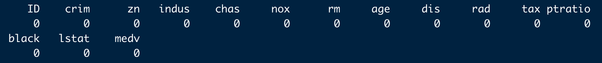
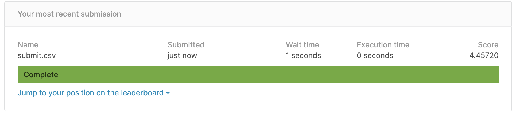

# [GroupID] Group 11 Boston Housing price

### Groups
* 曾偉綱	資科碩二	108753122
* 盧禹叡	經濟碩二	109258026
* 張修誠	資科碩一	110753165
* 邱顯安	資科碩一	110753110


### Goal
A breif introduction about your project, i.e., what is your goal?

### Demo 
Commend to reproduce our result

```R
Rscript performance.R --fold <k> --train data/training --test data/test --report results/performance.csv --predict result/predict.csv
```
* Shiny io app : https://brianchiu.shinyapps.io/finalproject/

## Folder organization and its related information

### docs
* Your presentation, 1101_datascience_FP_<yourID|groupName>.ppt/pptx/pdf, by **Jan. 13**
  * 
* Any related document for the final project
  * papers
  * software user guide

### data

* Form Kaggle API : $ kaggle competitions download boston-housing
* Input format : CSV
* Preprocessing
  * Check Missing value
  ```R
  colSums(is.na(data))
  ```
  
    No missing value
  * Outlier check & remove by box plot
  * Skewness check & process
  * Correlated Heat Map between Features 
  

### code

* Which method do you use?
  * We use Random forest model for our prediction.
  ```R
  train_control <- trainControl(method = "none")

  model <- train(medv~., data = train_data, method = "rf", trControl = train_control)
  ```
* What is a null model for comparison?
  * We compare our model with different select respectively
 ```R
 model <- train(medv~., data = train_data, method = "knn", trControl = train_control)
 model <- train(medv~., data = train_data, method = "lm", trControl = train_control)
 ```
 
 
 
 
* How do your perform evaluation? ie. cross-validation, or addtional indepedent data set
  * We use cross-validation to evaluate our performance, and also use the addtional indepedent dataset to check our prediction on Kaggle.
  
  
  
  
### results

* Which metric do you use 
  * We use RMSE as our metric.
* Is your improvement significant?
  * Yes, we improve the RMSE from 3.45 to 3.41
* What is the challenge part of your project?
  * Test chose the most appropriate features

## References
* Packages you use
  ```R
  library(caret)
  library(randomForest)
  library(ggvis)
  library(shiny)
  ```
* Related publications
    * Kaggle
        * https://www.kaggle.com/c/boston-housing/overview
    * shiny templete 
        * https://shiny.rstudio.com/gallery/
    * package
        * https://www.rdocumentation.org/packages/randomForest/versions/4.6-14/topics/importance
  
